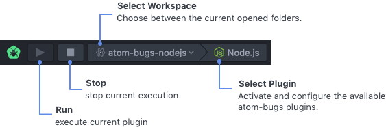

# Atom Bugs package

A Simple Debugging tool for Atom. `atom-bugs` is a base debugger UI provider, you will need  additionally install a specific debugger for your language.


### Installation

```
apm install atom-bugs
```

### Features

- Toolbar




- Breakpoints
- Debug Area
- Scheme Configuration
- Console Output

### API Documentation

on progress...

### Available Plugins

Below is the list of available plugins so far:

Package|Description
---|---
[NodeJS](https://atom.io/packages/atom-bugs-nodejs)|Run and debug javascript files using NodeJS 6.3+.

### Requirements
- atom 1.0.0+

### License

MIT
